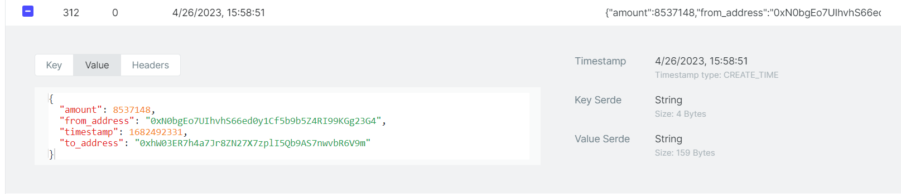

# Kafka Faker 
`Kafka Faker` is a fake message generator for kafka. It generates fake messages based on a schema and sends them to a kafka topic.

It's useful for a service that consumes messages from kafka, stream processing with tools (e.g. Apache Flink) or testing.

## Configuration
```yaml
kafka:
  brokers: localhost:29092
generators:
  - topic: sample_topic
    partitionKey: nil
    schema: |-
      {
        "from_address": "::ethereum_address()",
        "to_address": "::ethereum_address()",
        "amount": "::number(1,10)",
        "timestamp": "::timestamp()"
      }
    number: 5
    loop: true
    delay: 2s
```

## Test
First of all, you need to run kafka to test this app locally.
Use docker-compose to run kafka and kafka-ui.
```shell
$ docker-compose up -d
```

Then, build & run kafka-faker with the config file.

```shell
$ go build -o ./bin/kafka-faker .
$ ./bin/kafka-faker --config-file=config.yml
```



[Visit kafka-ui](http://localhost:8080/) to see the generated messages.
If you use docker-compose file. you can visit the kafka-ui at [http://localhost:8080/](http://localhost:8080/)

## LICENSE
MIT